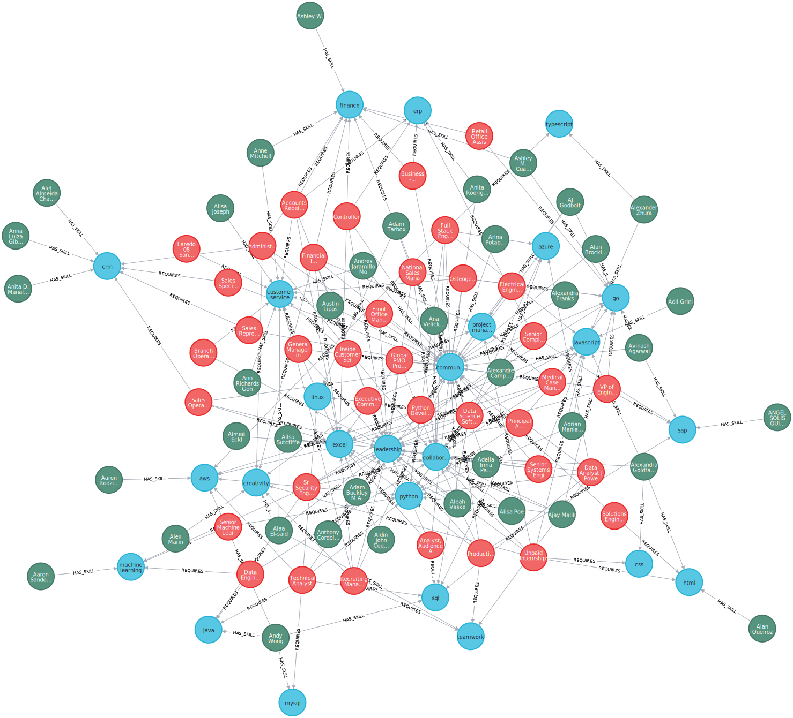
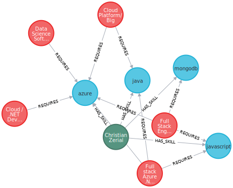
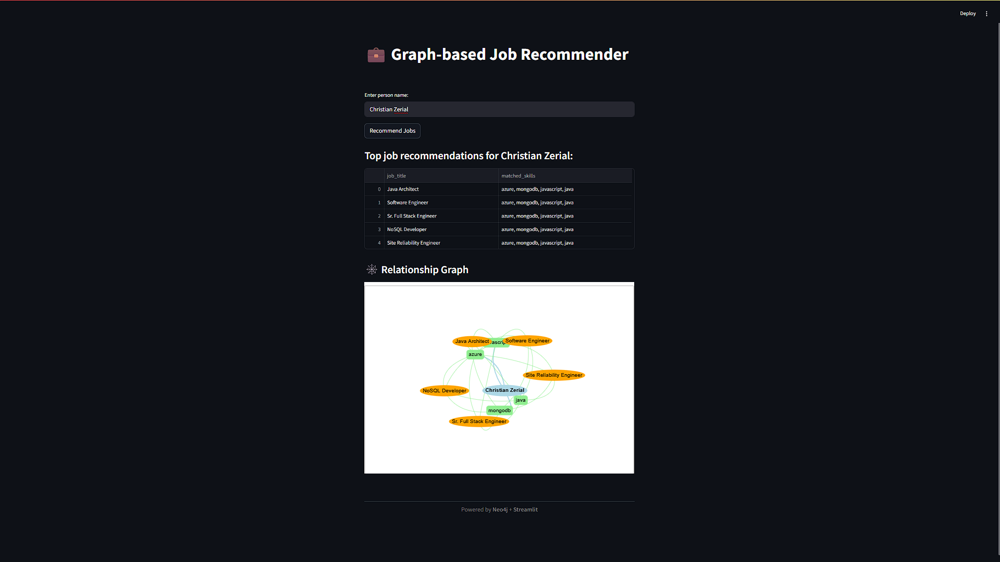

# Lightweight Graph-based Job Recommender using Neo4j and spaCy-based Skill Extraction

This project is a lightweight, open-source job recommendation system that leverages graph-based modeling in Neo4j and natural language processing using spaCy to extract skills from user profiles and job postings. It aims to deliver efficient job recommendations by modeling relationships between people, skills, and jobs as a graph.

---

## 📌 Features

- Skill extraction from LinkedIn profiles and job descriptions using spaCy
- Graph construction in Neo4j: `Person`, `Job`, and `Skill` nodes with relationships like `HAS_SKILL` and `REQUIRES`
- Querying job recommendations through Neo4j Cypher
- Lightweight, local-first, and LLM-free
- Open-source and reproducible using CSV data

---

## 🛠️ Tech Stack

| Component     | Tool                        |
|---------------|-----------------------------|
| Programming   | Python 3.10+                |
| NLP           | spaCy                       |
| Graph DB      | Neo4j (Bolt connection)     |
| Data Handling | pandas, csv                 |
| Visualization | Mermaid (Architecture Diagrams) |
| Versioning    | Git                         |

---

## 🧠 System Architecture



---

# 🚀 How to Run

1. Clone this repository

```
git clone https://github.com/Deceitfulz/Lightweight-Graph-based-Job-Recommender-using-Neo4j-and-SpaCy-based-Skill-Extraction.git
cd Lightweight-Graph-based-Job-Recommender-using-Neo4j-and-SpaCy-based-Skill-Extraction
```

2. Install dependencies

```
pip install -r requirements.txt
```

3. Prepare Neo4j database

- Run Neo4j locally and ensure Bolt connection is enabled

- Default credentials used in this project:

```
URL: bolt://localhost:7687
Username: nodes2025
Password: ihsanifan
```

4. Run the scripts

```
python scripts/extract_profile_skills.py
python scripts/generate_person_and_edges.py
python scripts/extract_skills.py
python scripts/generate_job_skill_edges.py
python scripts/import_to_neo4j.py
python scripts/get_recommendation.py
```

# 📈 Example Output
Sample format from `job_recommendations.csv`:

| Person ID | Person Name | Recommended Job Title | Matched Skill |
|---------------|-----------------------------| - | - |
| margot-bon-51a04624   |      Margot Bon           | Senior Elder Law / Trusts and Estates Associate Attorney | communication |
| benchalh-othmane-95925470           | BENCHALH Othmane                       | Senior Software Engineer - MFT | sql, communication, html, javascript, css, mysql|

Sample output from `cypher_query_sample.txt`
- All person starts with letter 'A'



- Spesific person (example: Christian Zerial)



# 📄 Dataset Source
- LinkedIn Job Posting Dataset (Kaggle)
https://www.kaggle.com/datasets/arshkon/linkedin-job-postings?select=postings.csv

- LinkedIn People Profiles Dataset (Kaggle)
https://www.kaggle.com/datasets/manishkumar7432698/linkedinuserprofiles?select=LinkedIn+people+profiles+datasets.csv

# 💎 Simple UI

Check out our simple UI that can be accessed from `app.py`

Run it with command:
```
streamlit run app.py
```




# 🤝 Acknowledgements
- spaCy
- Neo4j
- Streamlit

Inspired by lightweight AI engineering and graph-based solutions for talent matching.